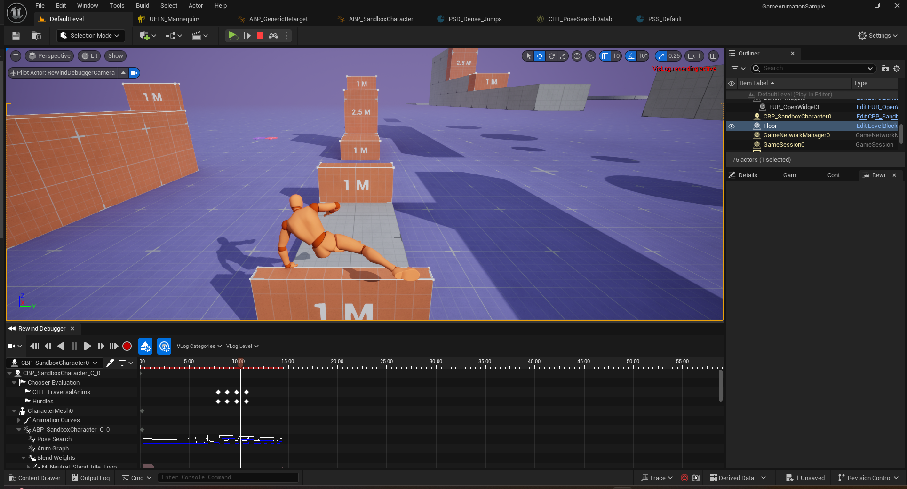
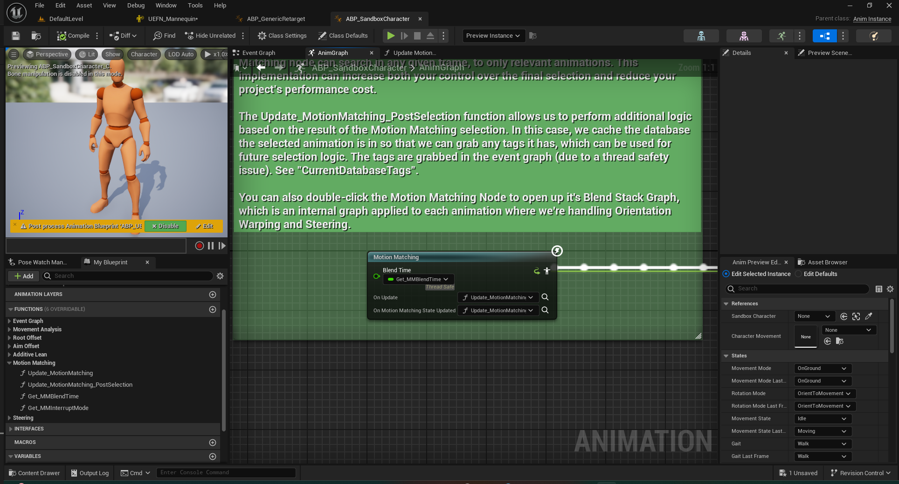
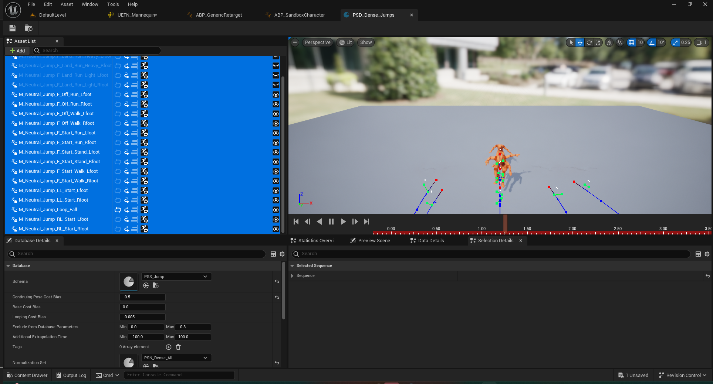

This blog is about diving into the official implementation of motion matching in UE 5.4 and how to add it and modify it into our own project. I myself am still learning UE and motion stuff, so forgive me if there is somewhere wrong or inappropriate.

UE 5.4 with Motion Matching
======

UE 5.4 has been released for nearly three months (actually I forgot how long since it was released, let's suppose it is 3 months), and the most blockbuster update would be the **Official Motion Matching**. In this year, the most sold game BlackMyth: Wukong claimed that they used Motion Matching to reduce the workloads of character animation and enhance the reality in their game, while they didn't use the official one. Actually, they bought a plugin from the UE market at first and spent some times to modify it so that the plugin can meet their needs, and I think it's quite tough work and UE does save us a lot of times. By the way, as for motion matching, I also implement it by myself in python for my homework, and I record it in another blog, thanks for Daniel's blog [The Orange Duck](https://www.theorangeduck.com/).

Motion Matching
======

OK, let's first talk about the motiong matching. Motion Matching [Clavet 2016] is one of the most significant and revolutional technology in character animation and game industry. I don't want to spend too much time on the theoretical things, because there have been too many blogs and papars trying to explain how motion matching works in detail, and I also wrote about that in another blog about implementing motion matching in python. Generally speaking, instead of using the handcrafted animation to motivate characters, motion matching directly searches for the most plausible pose in a mocap database to generate the next motion.

I want to talk about something more general, something like the advantages and limitations of motion matching. 

The Implementation in Official Motion Matching Sample
======

Overview
------

When you open the Game Animation Sample project, there will be something like this.

```
Content
├───Blueprints
│   ├───AnimModifiers
│   ├───AnimNotifies
│   ├───Data
│   └───RetargetedCharacters
├───Characters
|   |...
│   └───UEFN_Mannequin
│       ├───Animations
│       │   |...
|       |...
|...
```

That's all the core files. Motion matching is quite simple, nothing more than a database and an animation blueprint that defines how to search for poses and does some modifications, oh, and a character of course. All the other files in the project is less important for the motion matching system, they may be retargeting profiles or something else.

The first file we want to dive into is the *ABP_SandboxCharacter*, you can search it with **Ctrl + P** or go to "Blueprints/" -- it's in the top directory. Open it, and you will see such an animgraph.



In this graph, you can see there is the core node of the whole animgraph, namely **Motion Matching**. There's a long paragraph of anotation that describe how to use this node, and there're three function slots in it, the first is **Blend Time**, lower one is **On Update**, then the last is **On Motion Matching State Updated**.

Let's focus on the anotation first. The green block is too long, but calm down, I won't paste it here, just to summary it instead. According to the anotation, a pose search database and a pose history record is required. The pose search database is a UE assets containing the animations to be searched, and the pose history contains past pose and trajectory of character to query. Database can be pre-provided as a certain assets, or dynamically change when the node update. In the sample case, they load animations into different databases and use a chooser to dynamically choose the database to search.



References
------
[1] Simon Clavet. 2016. Motion Matching and The Road to Next-Gen Animation. GDC ’16 (March 2016). (https://www.gdcvault.com/play/1023280/Motion-Matching-and-The-Road)