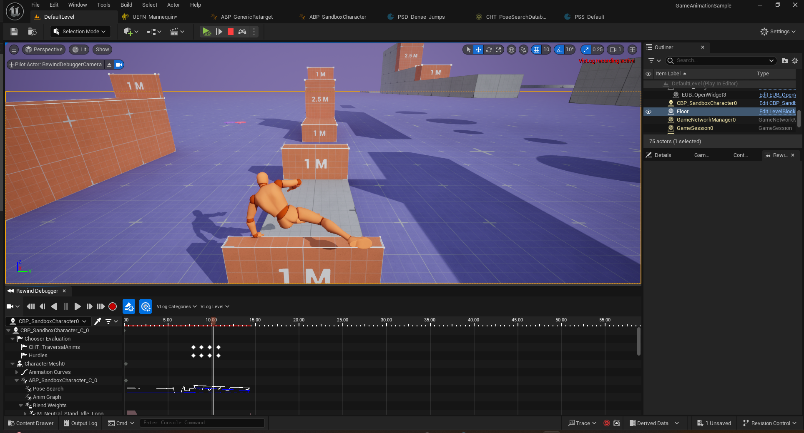

This blog records the process I did one of my Deep Learning homeworks about NER. In this task, I finetuned a series of bert-like models to complete one of nlp tasks called NER (Named Entity Recognition) on the subset of MultiCoNER dataset from scratch. I will show how to process the data, tokenize the raw sentences and finetune the model to get better results. I finally achieved **accuracy**: xxx, **precision**: xxx, **recall**: xxx, and **F-score**: xxx in this task.

Task Description
=======================

To understand the full meaning of a sentence, we need to separate the words in a sentence based on the difference in its signified entities. For example, "John likes phone produced by Apple." In this sentence, we can label that "John" is a person, "phone" is an object and "Apple" is a corporation, which leading us to fully understand the meaning of this sentence. Without these priority, we cannot figure out the relationships between these nouns appear in the sentence. And the task to **figure out the label of each entity in the sentence** is called **NER**, namely **Named Entity Recognition**.

HuggingFace has a short introduction on this task: [Introduction on NER](https://huggingface.co/tasks/token-classification). They also offer some example code for this task: [NER Example](https://huggingface.co/docs/transformers/main/en/tasks/token_classification).

Load the Dataset
===

GAS is a plugin in Unreal Engine since 5.2.

Initialize the Game
===================

Create a New Game Project
-------------------------

OK, let's first talk about the motiong matching. Motion Matching [Clavet 2016] is one of the most significant and revolutional technology in character animation and game industry. I don't want to spend too much time on the theoretical things, because there have been too many blogs and papars trying to explain how motion matching works in detail, and I also wrote about that in another blog about implementing motion matching in python. Generally speaking, instead of using the handcrafted animation to motivate characters, motion matching directly searches for the most plausible pose in a mocap database to generate the next motion.

I want to talk about something more general, something like the advantages and limitations of motion matching.

Create the Character Classes
----------------------------

Game Ability System
===================

Why we need a separated Player State?
-------------------------------------

GAS in Multiplayer
------------------

* Multiplayer games
  * Server is the Authority

    Multiplayer means multiple computer. We have to decide which one is in charge if some differences happen, and actually they always happen because of the network lag. Since the latency may be too large somtimes, it may lead to some disasters, like that one player may die from your damage in your version of game while he/she also killed you on his computer. That's terrible. So we have to choose one 'correct' computer and let it do all 'important' work, like changing health, applying damages. In most cases, we choose the server as the chief.
  * What is on the Server?
  * What is on Clients?
  * How to modify attributes?
