# How to install `ros-noetic` on a `Docker` container and visualize it

Frankly speaking, I'm kind of tired of installing different horrible libraries and applications into my pity vulnerable ubuntu system, which is pretty dull and time-wasting, and make my little lovely linux a big big freak. Since then, it comes to me why not separate everything apart, and I finally get the point why people love containers that can separate bananas and apples apart so that the ethylene released by apples will not make bananas rot - similarly, `ros` will destory the whole environment if you do not know everything about your system well and are not careful enough. For most people in the world, including me of course, neither do we know everything in their system, nor are careful enough, so we need a external thing to help us overcome this obstacle, and `Docker` is a good choice. 

## Install `Docker`

If we want to use `Docker` then we have to install it first. Since we are freshmen, the one with GUI is better.

U can download `Docker Desktop` from their [homepage](https://www.docker.com/): Go to their page, click the 'Download Docker Desktop' and select the one fit your platform. Finally, You will download the installer.

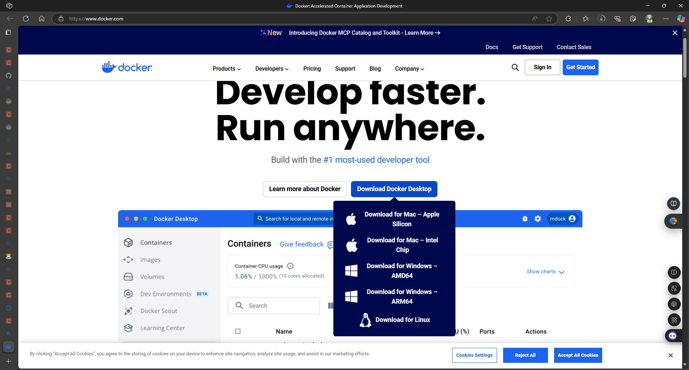

I'm on windows so I selected 'Download for Windows - AMD64', and [the guideline on installing docker](https://docs.docker.com/desktop/setup/install/windows-install/) are also based on windows platform. Which means if you use Mac, probably you have to finish the install following [the Mac guideline](https://docs.docker.com/desktop/setup/install/mac-install/).

* [Install the docker on Windows](https://docs.docker.com/desktop/setup/install/windows-install/)
* [Install the docker on Mac](https://docs.docker.com/desktop/setup/install/mac-install/)

After your installation, you should see such a interface.

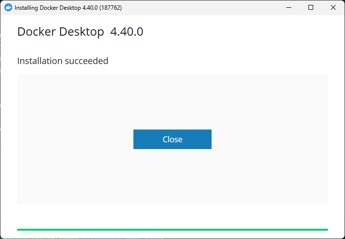

Maybe not `4.40.0`, maybe your version is a little bit higher -- or a little bit lower, it doesn't matter.

## Next step, pull a `ros` environment

If you are a freshmen to docker, just like me, maybe you have been confused by the new nouns -- What is image? What is container? No worry! I will not mention anything about them in this tutorial, since I'm preparing for my final exam and have no time to waste.

So the next step is open the `Docker Desktop` -- and of course, sign in if it asked you, and click the big search right in the middle of the head bar, and type ros, here the result you might see.

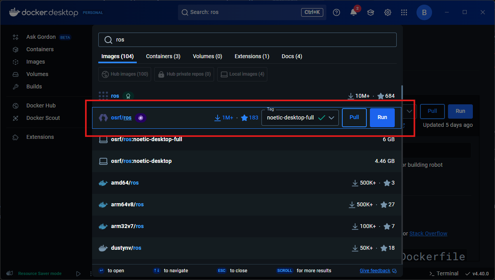

In the `Images` selection, select the entry circled in the red frame, change its version in the Tag to `noetic-desktop-full` because this homework is based on noetic and click `Pull` (Not `Run`) to pull this one to your local machine. If you asked me what's the difference between this one and the other `noetics`, I don't know, and I used this one because it's the biggest one, and the 'full' in its name gives me a sense of security.

## Side Quest, download VcXsrv to enable X11 on Windows

<mark>This step is for Windows, I don't know whether it works on Mac</mark>

Since Windows doesn't support X11, we have to manually build the bridge. [VcXsrv](https://github.com/marchaesen/vcxsrv) implement the X11 service for windows so windows can display linux stuffs, follow this [link](https://sourceforge.net/projects/vcxsrv/) and download it. 

Now start **XLaunch** and configure it as I show you.

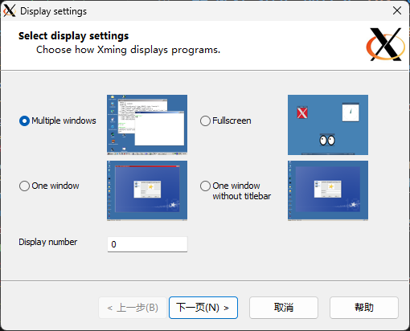

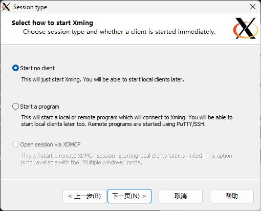

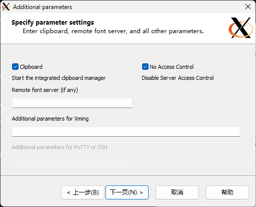

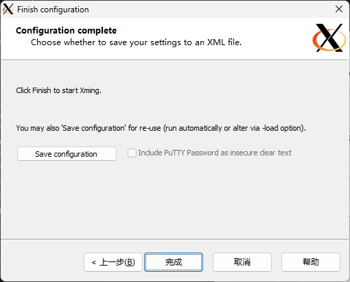

Basically, just click 'Next Page' and 'Finish' is OK.

## Dawn is comming, create a `ros` environment

From now on, u will be asked to possess some computer pre-requisite, like knowing how to type and how to copy and paste. So if you are using Windows, press `Win` + `X` and press `I` （记得把输入法调成英文）to call the console, and unfortunately, I don't know how to call the terminal on Mac but as long as you know, it's OK. 

The first thing you need to do is set the environment variable
```
set-variable DISPLAY 127.0.0.1:0.0
```
Or you can just set it in the System Settings. 

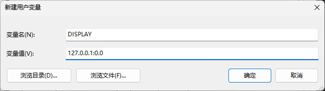

You can check the variable with `echo $DISPLAY` in Windows Powershell.

For Mac, 
```
export DISPLAY=127.0.0.1:0.0
``` 
for a temp environment and 
```
echo "export DISPLAY=127.0.0.1:0.0" >> ~/.bashrc
``` 
for a permanent environment variable set. And then you can check the variable with `echo $DISPLAY`.

Finally, all the preparations are done and we can create an environment for ros noetic. Use 
```
docker run -it --name \<your-prefered-name\> -e DISPLAY=host.docker.internal:0.0 osrf/ros:noetic-desktop-full
```
to create the environment, and the following picture is what you should see. The username is a random hashcode, so it's certainly that yours is different from mine.

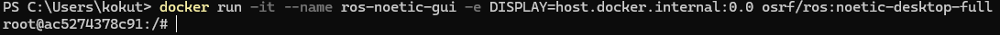

Call `rviz` to check whether the display works well. If such error prompts, then it should be fine.

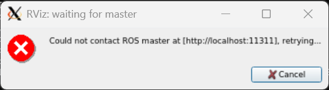

Next step, type
```
echo "export /opt/ros/noetic/setup.bash" >> ~/.bashrc
```
to setup the terminal and call
```
apt-get update
```
<mark>REMEMBER NO `sudo` THIS TIME</mark>

Further more, you can use vscode to connect to that environment and this is not what I'm going to talk about in this article.

## In the end

In this environment, there's no need for you to install and configure ros-noetic again, you can prepare for Saint Zhangfu's homework directly from this step.

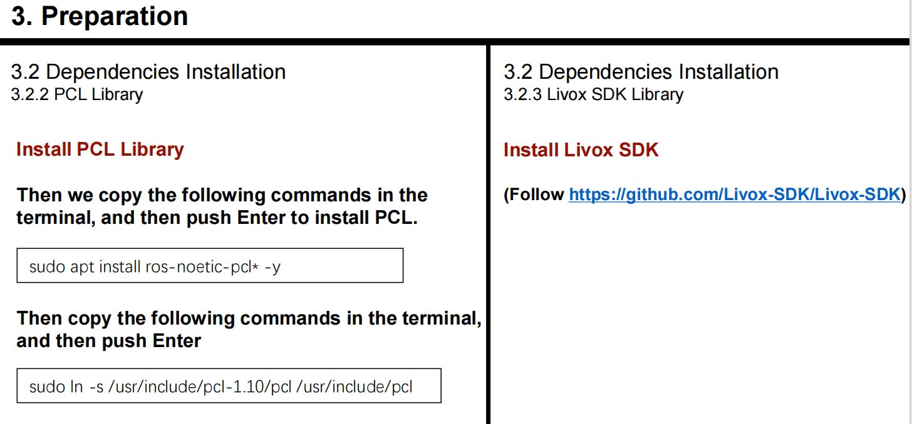

The following work needs little change in the environment and is much easier than installing and configuring the ros, I believe you can done by yourselves.


